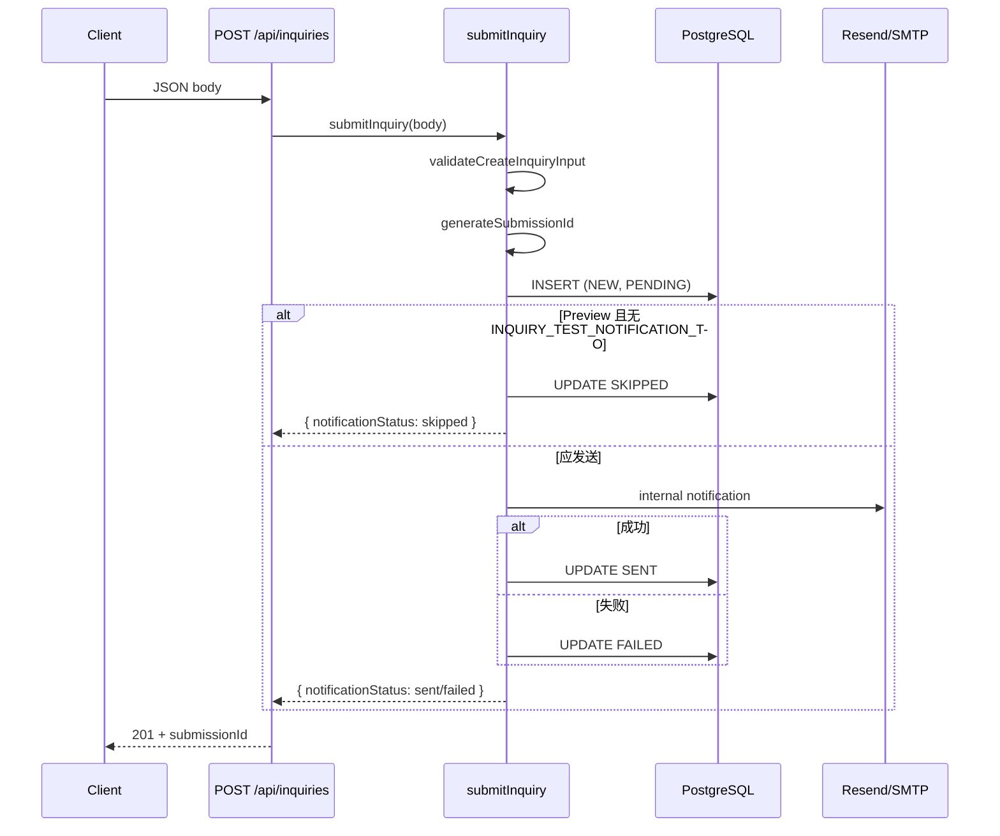

# PR-C2：KoraScale 统一 Inquiry 后台基础设施

**日期：** 2026-06-19  
**范围：** 数据库模型、服务层、API、邮件通知、测试  
**不包含：** 前台入口迁移；Journey Request、PlanTripModal、Contact、Corporate Travel、Inspiration CTA 行为变更  
**状态：** 已实现，待验收 commit（当前工作区有未提交改动）

**关联文档：** [booking-inquiry-contact-audit.md](./booking-inquiry-contact-audit.md)

---

## 1. 执行摘要

PR-C2 为 KoraScale 建立独立于 `bookings` 的统一 **inquiries** 后台基础设施：

| 能力 | 说明 |
|------|------|
| 数据模型 | PostgreSQL `inquiries` 表 + migration 018 |
| 校验层 | 手写 schema（无 Zod），拒绝客户端注入 status / notification 字段 |
| 服务层 | `submitInquiry`：校验 → 入库 → 内部通知邮件 → 更新 notification 状态 |
| API | `POST /api/inquiries`（201 / 400 / 500 / 405） |
| 邮件 | 复用 Resend / SMTP；内部收件人与公开客服邮箱分离 |
| 测试 | 22 个单元测试（schema / service / API / email sender） |

现有 `/api/plan-trip` 与 `/api/bookings` **保持不变**；plan-trip 仅抽取共享邮件 sender，行为等价。

---

## 2. 实施前现状（沿用规范）

### 2.1 数据库

- **访问方式：** `pg` Pool（`src/lib/db.ts`）
- **连接串：** `NEON_POSTGRES_URL` 或 `POSTGRES_URL`
- **Migration：** `database/migrations/NNN_*.sql` 编号 SQL；复用 `update_updated_at_column()` 触发器
- **命名规范：** UUID 主键、`snake_case` 列、`created_at` / `updated_at`（`TIMESTAMP DEFAULT NOW()`）

### 2.2 现有表参考（bookings）

```sql
-- 摘自 database/migrations/010_bookings_complete_schema.sql
id UUID PRIMARY KEY DEFAULT gen_random_uuid()
status VARCHAR(50) DEFAULT 'REQUESTED'
created_at TIMESTAMP DEFAULT NOW()
updated_at TIMESTAMP DEFAULT NOW()
```

### 2.3 邮件（plan-trip 原有实现）

- **Provider 顺序：** Resend（`RESEND_API_KEY`）→ SMTP（`SMTP_*`）→ dev fallback（console + `dev-mode-*` messageId）
- **收件人：** `CUSTOMER_SERVICE_EMAIL`（公开客服邮箱）
- **无数据库写入**

### 2.4 其他

- **Validation library：** 无 Zod；本 PR 手写校验
- **API 响应：** `NextResponse.json({ success, error / errors })`；500 不暴露 DB 连接信息
- **环境：** `VERCEL_ENV` 区分 preview / production；`NEXT_PUBLIC_*` 仅客户端

---

## 3. 修改文件清单

### 3.1 新增（15 个文件）

| 路径 | 职责 |
|------|------|
| `database/migrations/018_create_inquiries_table.sql` | 创建 `inquiries` 表、索引、触发器 |
| `database/migrations/018_create_inquiries_table.rollback.sql` | 回滚 018 |
| `src/lib/inquiries/types.ts` | intent / sourceType / channel 枚举与 TypeScript 类型 |
| `src/lib/inquiries/schema.ts` | 输入校验、trim、JSON 体积限制、禁止客户端字段 |
| `src/lib/inquiries/schema.test.ts` | Schema 单元测试 |
| `src/lib/inquiries/submissionId.ts` | 生成 `KS-YYYYMMDD-XXXXXX` |
| `src/lib/inquiries/environment.ts` | Preview / Production 邮件路由 |
| `src/lib/inquiries/repository.ts` | `insertInquiry` + `updateInquiryNotificationStatus` |
| `src/lib/inquiries/notificationEmail.ts` | 内部通知邮件正文与发送 |
| `src/lib/inquiries/submitInquiry.ts` | 核心 submit 流程 |
| `src/lib/inquiries/submitInquiry.test.ts` | Service 单元测试 |
| `src/lib/email/sendTransactionalEmail.ts` | 共享 transactional 邮件 sender |
| `src/lib/email/sendTransactionalEmail.test.ts` | plan-trip 兼容回归测试 |
| `src/app/api/inquiries/route.ts` | `POST /api/inquiries` |
| `src/app/api/inquiries/route.test.ts` | API 单元测试 |

### 3.2 修改（2 个文件）

| 路径 | 变更 |
|------|------|
| `src/app/api/plan-trip/route.ts` | 改用 `sendTransactionalEmail` + `getPublicCustomerServiceEmail()` |
| `env.example.txt` | 增加 `INQUIRY_NOTIFICATION_TO` / `INQUIRY_TEST_NOTIFICATION_TO` 注释 |

### 3.3 明确未修改

- PlanTripModal、Journey Request UI、`POST /api/bookings`
- Contact 页、Article / Corporate / Inspiration CTA
- Header / Footer、`contactChannels`、SEO、sitemap、admin UI

---

## 4. inquiries 数据模型

### 4.1 表结构

```sql
CREATE TABLE inquiries (
  id UUID PRIMARY KEY DEFAULT gen_random_uuid(),
  submission_id VARCHAR(32) NOT NULL UNIQUE,

  intent VARCHAR(50) NOT NULL,
  source_type VARCHAR(50) NOT NULL,
  source_page TEXT,
  source_slug VARCHAR(255),
  source_context JSONB NOT NULL DEFAULT '{}'::jsonb,

  channel VARCHAR(20) NOT NULL DEFAULT 'form',

  name VARCHAR(255) NOT NULL,
  email VARCHAR(255) NOT NULL,
  phone VARCHAR(50),
  message TEXT,

  details JSONB NOT NULL DEFAULT '{}'::jsonb,

  status VARCHAR(50) NOT NULL DEFAULT 'NEW',

  notification_status VARCHAR(20) NOT NULL DEFAULT 'PENDING',
  notification_provider_id VARCHAR(255),
  notification_error VARCHAR(500),

  created_at TIMESTAMP NOT NULL DEFAULT NOW(),
  updated_at TIMESTAMP NOT NULL DEFAULT NOW()
);
```

**索引：** `submission_id`, `intent`, `source_type`, `status`, `notification_status`, `created_at DESC`, `email`

**触发器：** `update_inquiries_updated_at` → `update_updated_at_column()`

### 4.2 枚举与默认值

#### intent（至少支持）

`journey_request`, `custom_journey`, `corporate_visit`, `article_inquiry`, `healthcare`, `group_tour`, `accommodation_inquiry`, `general_contact`

#### source_type（至少支持）

`journey`, `article`, `homepage`, `solution`, `contact`, `support`, `direct`, `unknown`

#### channel（至少支持）

`form`, `email`, `whatsapp`

#### status

新询盘默认 `NEW`（`VARCHAR(50)`，预留 CRM 扩展）

#### notification_status

`PENDING` → `SENT` | `FAILED` | `SKIPPED`（与 inquiry 是否入库分离）

### 4.3 JSONB 使用原则

| 字段 | 用途 | 示例 |
|------|------|------|
| `source_context` | 来源上下文 | `journeySlug`, `journeyTitle`, `articleSlug`, `articleTitle`, `sourceCta`, `referrer` |
| `details` | 按 intent 扩展 | `travelDates`, `adults`, `children`, `groupSize`, `destinations`, `company`, `visitPurpose`, `selectedDeparture`, `estimatedPrice`, `specialRequests` |

**限制：** 每个 JSON 对象最大约 10KB（应用层校验）；不为所有可能字段建 nullable 列。

**禁止入库：** API key、cookie、authorization header、完整 request headers。

---

## 5. 类型与验证层

**位置：**

- `src/lib/inquiries/types.ts` — 共享类型
- `src/lib/inquiries/schema.ts` — `validateCreateInquiryInput()`

### 5.1 校验规则

| 字段 | 规则 |
|------|------|
| `intent` | 必须在允许列表内 |
| `sourceType` | 必须在允许列表内 |
| `channel` | 必须在允许列表内 |
| `name` | 必填，最大 255 |
| `email` | 必填，格式校验，转小写 |
| `phone` | 可选，最大 50 |
| `message` | 可选，最大 5000（超长拒绝，非截断） |
| `sourcePage` | 站内路径（`/` 开头）或合法 http(s) URL，最大 2048 |
| `sourceContext` / `details` | 必须为 plain object，JSON 体积 ≤ 10KB |

### 5.2 拒绝的客户端字段

`id`, `submissionId`, `status`, `notificationStatus`, `notificationError`, `notificationProviderId`, `createdAt`, `updatedAt`

---

## 6. Repository / Service 架构

```
src/lib/inquiries/
├── submissionId.ts      # generateSubmissionId()
├── repository.ts          # insertInquiry(), updateInquiryNotificationStatus()
├── notificationEmail.ts   # sendInquiryNotificationEmail()
├── submitInquiry.ts       # submitInquiry() 核心编排
├── environment.ts         # resolveInquiryNotificationRouting()
├── schema.ts              # validateCreateInquiryInput()
└── types.ts
```

### 6.1 submissionId 格式

```
KS-YYYYMMDD-XXXXXX
例：KS-20260619-ABC123
```

- 日期：UTC
- 后缀：6 位大写字母数字（排除易混淆字符）

### 6.2 submitInquiry 执行顺序

1. **校验输入** → 失败抛 `InquiryValidationError`
2. **生成 submissionId**
3. **数据库 INSERT**（`status=NEW`, `notification_status=PENDING`）→ 失败抛 `InquiryPersistenceError`，**不发邮件**
4. **解析邮件路由**（`resolveInquiryNotificationRouting`）
   - Preview 无测试邮箱 → UPDATE `SKIPPED`，返回 success
   - Production 无 `INQUIRY_NOTIFICATION_TO` → UPDATE `FAILED`（路由失败），返回 success
5. **发送内部通知邮件**（`allowDevFallback: false`）
   - 成功 → UPDATE `SENT` + `notification_provider_id`
   - 失败 → UPDATE `FAILED` + 清理后的 `notification_error`（≤500 字符）
6. **返回** `{ submissionId, notificationStatus }`（小写）

**邮件失败时：** inquiry 仍保留；API 可返回 `success: true`，`notificationStatus: failed`。

---

## 7. API 合约

### 7.1 `POST /api/inquiries`

**Content-Type：** `application/json`

#### 请求示例

```json
{
  "intent": "journey_request",
  "sourceType": "journey",
  "sourcePage": "/journeys/chengdu-deep-dive",
  "sourceSlug": "chengdu-deep-dive",
  "sourceContext": {
    "journeySlug": "chengdu-deep-dive",
    "journeyTitle": "Chengdu Deep Dive",
    "sourceCta": "REQUEST TO BOOK",
    "referrer": "https://korascale.com/journeys/chengdu-deep-dive"
  },
  "channel": "form",
  "name": "Jane Doe",
  "email": "jane@example.com",
  "phone": "+86 155 5648 6995",
  "message": "We prefer a private guide.",
  "details": {
    "adults": 2,
    "children": 0,
    "travelDates": "2026-09-01 to 2026-09-10",
    "destinations": ["Chengdu", "Leshan"],
    "specialRequests": "Vegetarian meals"
  }
}
```

#### 成功响应（HTTP 201）

```json
{
  "success": true,
  "submissionId": "KS-20260619-ABC123",
  "notificationStatus": "sent"
}
```

`notificationStatus` 取值：`sent` | `failed` | `skipped`（小写）

#### 校验失败（HTTP 400）

```json
{
  "success": false,
  "errors": {
    "email": "Invalid email format"
  }
}
```

#### 持久化失败（HTTP 500）

```json
{
  "success": false,
  "error": "Failed to submit inquiry. Please try again later."
}
```

#### 不支持的方法

GET / PUT / PATCH / DELETE → **405** `{ "error": "Method not allowed" }`

**本 PR 无公开 GET 查询接口**，不允许前端读取全部 inquiries。

---

## 8. 内部通知邮件

### 8.1 Provider 复用

共享模块：`src/lib/email/sendTransactionalEmail.ts`

| 调用方 | `allowDevFallback` | 行为 |
|--------|-------------------|------|
| `/api/plan-trip` | `true`（默认） | 无 provider 时 dev-mode 成功（与原行为一致） |
| Inquiry 通知 | `false` | 无 provider 时 `FAILED`，不伪造成功 |

Provider 顺序：Resend → SMTP →（plan-trip only）dev fallback

### 8.2 邮箱分离

| 用途 | 环境变量 | 说明 |
|------|----------|------|
| 公开客服（plan-trip） | `CUSTOMER_SERVICE_EMAIL` | 默认 `customer-service@korascale.com` |
| 内部询盘通知（Production） | `INQUIRY_NOTIFICATION_TO` | **server-only**，勿用 `NEXT_PUBLIC_` |
| Preview / Dev 测试收件 | `INQUIRY_TEST_NOTIFICATION_TO` | 未设置则 SKIPPED |

### 8.3 邮件正文包含

- submissionId, intent, sourceType, sourcePage
- name, email, phone, message
- sourceContext, details（JSON 格式化）
- createdAt (UTC ISO)

### 8.4 Preview / Production 隔离

| 环境 | 条件 | 结果 |
|------|------|------|
| Preview / Development / 非 production | 有 `INQUIRY_TEST_NOTIFICATION_TO` | 发到测试邮箱 |
| Preview / Development / 非 production | **无**测试邮箱 | 入库 + `SKIPPED`，**不向真实业务邮箱发送** |
| Production | 有 `INQUIRY_NOTIFICATION_TO` + provider | 正常发送 |
| Production | 无 `INQUIRY_NOTIFICATION_TO` | 入库 + notification `FAILED`（路由未配置） |

---

## 9. 日志与隐私

### 9.1 允许记录

- submissionId, intent, notificationStatus
- provider message ID
- sanitized error code（如 `INQUIRY_INSERT_FAILED`, `INQUIRY_EMAIL_FAILED`）

### 9.2 禁止记录

- 完整客户 message
- 完整 phone
- API key、邮件 provider secret
- 数据库连接字符串
- cookie、authorization header

`notification_error` 仅保存清理后的摘要，最大 500 字符。

---

## 10. 测试

### 10.1 覆盖清单

#### Schema tests（`schema.test.ts`）

- 合法 general inquiry
- 合法 journey inquiry（含 details）
- 非法 email
- 非法 intent
- 过长 message
- 客户端注入 status
- 过大的 details / sourceContext
- submissionId 格式
- Preview 无测试邮箱时 routing = skip

#### Service tests（`submitInquiry.test.ts`，mock repository + email）

1. 入库成功 + 邮件成功 → `sent`
2. 入库成功 + 邮件失败 → `failed`，inquiry 保留
3. 入库失败 → 不发邮件，抛 `InquiryPersistenceError`
4. Preview 无测试邮箱 → `skipped`
5. submissionId 唯一格式

#### API tests（`route.test.ts`，mock submitInquiry）

1. 合法请求 → 201
2. 验证失败 → 400 + field errors
3. DB 失败 → 安全 500
4. 邮件失败但 DB 成功 → success=true
5. 响应不泄露内部错误 / 敏感配置
6. GET → 405

#### Email sender tests（`sendTransactionalEmail.test.ts`）

- 无 provider 时 dev fallback（plan-trip 兼容）
- 配置 Resend 时走 Resend 路径

### 10.2 验收结果（2026-06-19）

| 命令 | 结果 |
|------|------|
| `git diff --check` | ✅ 通过 |
| `npx tsc --noEmit` | ✅ 通过 |
| `npx vitest run`（上述 4 文件） | ✅ 22/22 |
| `npm run build` | ✅ 通过 |

**约束：** 测试不写入 Production DB、不发送真实邮件、不使用真实客户邮箱。

---

## 11. Migration 与 Rollback

### 11.1 应用 migration

```bash
psql "$POSTGRES_URL" -f database/migrations/018_create_inquiries_table.sql
```

或使用项目既有 `scripts/run-migration.js` 流程（按团队惯例）。

### 11.2 Rollback

```bash
psql "$POSTGRES_URL" -f database/migrations/018_create_inquiries_table.rollback.sql
```

Rollback 会删除 `inquiries` 表及全部索引/触发器；**不修改 `bookings`，不迁移历史 bookings 数据**。

### 11.3 部署前必做

Production / Preview 部署 **018 migration 前**，`POST /api/inquiries` 会因表不存在而 500。

---

## 12. 尚未迁移的前台流程（PR-C3 范围）

| 入口 | 当前路径 | PR-C2 状态 |
|------|----------|------------|
| PlanTripModal | `POST /api/plan-trip` | 未改 |
| Journey REQUEST TO BOOK | `POST /api/bookings` | 未改 |
| Contact 页 | Email / WhatsApp 链接 | 未改 |
| Article / Corporate CTA | PlanTripModal 或 Contact | 未改 |
| WhatsApp 深链 | 外部 | 未改 |

---

## 13. 风险与 PR-C3 建议

### 13.1 风险

1. **Migration 需手动执行** — 018 未自动跑时 API 不可用
2. **Production 环境变量** — 需同时配置 `INQUIRY_NOTIFICATION_TO` 与 Resend/SMTP
3. **分支叠加** — 当前改动可能在 PR-C1 分支上，建议独立 `pr-c2/inquiry-backend` PR
4. **plan-trip refactor** — 已通过 `allowDevFallback` 保持 dev 假成功；有 provider 时行为不变

### 13.2 PR-C3 建议

1. PlanTripModal → `POST /api/inquiries`（`intent: custom_journey`）
2. Journey Request → inquiries 或 bookings + inquiries 双写
3. Corporate / Article / Healthcare CTA 携带 `sourceType` + `sourceContext`
4. Admin 询盘列表（只读 + status 更新）
5. 可选：Contact 表单恢复并对接 API

---

## 14. 环境变量配置

在 `env.example.txt` 中新增（server-only）：

```bash
# Production 内部询盘通知收件邮箱
# INQUIRY_NOTIFICATION_TO=ops-inbox@yourdomain.com

# Preview / Development 测试收件（未设置时 inquiry 入库但 notificationStatus=SKIPPED）
# INQUIRY_TEST_NOTIFICATION_TO=preview-inbox@yourdomain.com
```

已有变量（邮件发送）：

```bash
RESEND_API_KEY=...
RESEND_FROM_EMAIL=...
# 或 SMTP_HOST / SMTP_USER / SMTP_PASS / SMTP_FROM
CUSTOMER_SERVICE_EMAIL=customer-service@korascale.com
```

---

## 15. 架构流程图



---

## 16. Git 状态（文档生成时）

```
On branch pr-c1/block-dead-inquiry-entries

Changes not staged for commit:
  modified:   env.example.txt
  modified:   src/app/api/plan-trip/route.ts

Untracked:
  database/migrations/018_create_inquiries_table.sql
  database/migrations/018_create_inquiries_table.rollback.sql
  src/app/api/inquiries/
  src/lib/email/
  src/lib/inquiries/
```

**已跟踪文件 diff stat：**

```
 env.example.txt                |  9 ++++++
 src/app/api/plan-trip/route.ts | 69 +++++++++++-------------------------------
 2 files changed, 26 insertions(+), 52 deletions(-)
```

另新增 15 个未跟踪文件（约 1782 行）。

---

*本文档对应 PR-C2 实现交付物；前台迁移见后续 PR-C3。*
